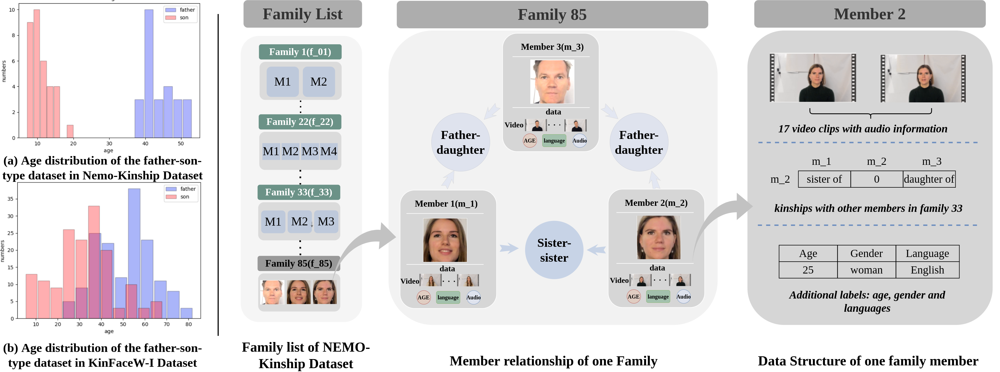

# Datasets

You can download the corresponding datasets by click the link.

[CornellKin](http://chenlab.ece.cornell.edu/projects/KinshipVerification/)

[UB KinFace](http://www1.ece.neu.edu/~yunfu/research/Kinface/Kinface.htm)

[Family101](http://chenlab.ece.cornell.edu/projects/KinshipClassification/index.html)

[KinFaceW-I&II](http://www.kinfacew.com/)

[TSKinFace](http://parnec.nuaa.edu.cn/_upload/tpl/02/db/731/template731/pages/xtan/TSKinFace.html)

[KIVI](http://iab-rubric.org/resources/KIVI.html)

[FIW](https://web.northeastern.edu/smilelab/fiw/)

# Methods
You can train relevant methods by running corresponding scripts:

***Training + Testing***

```python
python train_attention.py
```
***Training + Testing***

```python
python train_cnn.py
```
***Training + Testing***

```python
python train_deep_shallow.py
```

# data
<center>
 
 <figcaption>   </figcaption>
</center>
